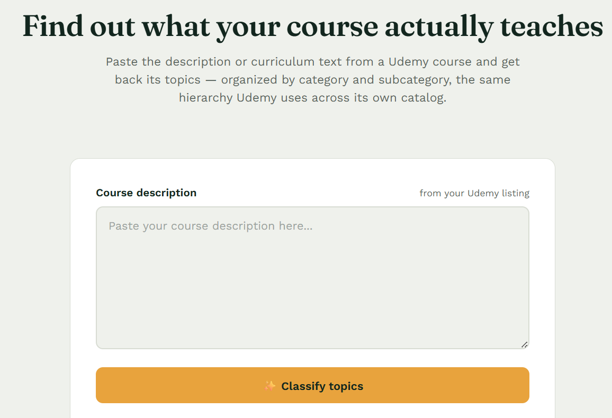
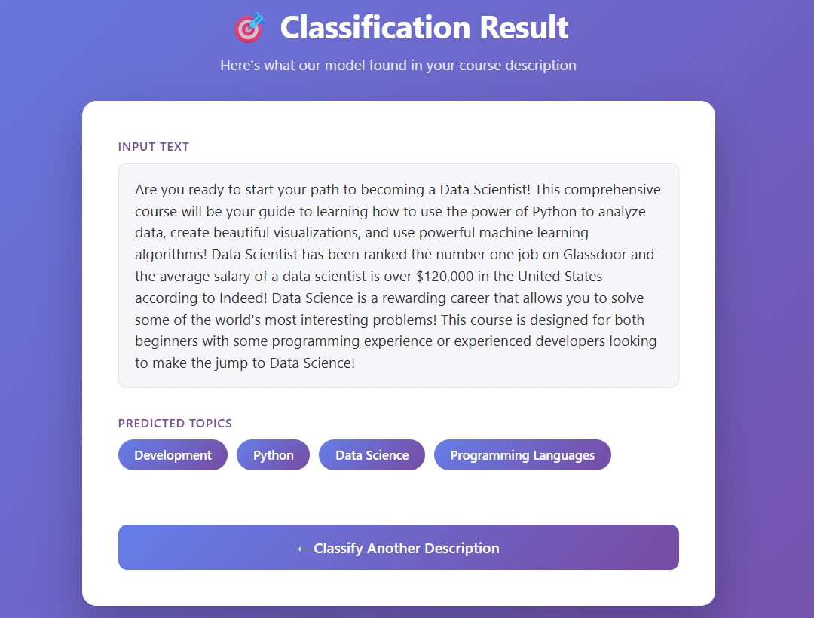

# Multilabel Course Topic Classifier

🔗 **Live demo:** [multilabel-course-topic-classifier-2.onrender.com](https://multilabel-course-topic-classifier-2.onrender.com/)  
🔗 **Gradio / HuggingFace Space:** [huggingface.co/spaces/SheikhAnandee/multilabel-udemy-course-classifier](https://huggingface.co/spaces/SheikhAnandee/multilabel-udemy-course-classifier)

---

## Table of Contents

- [Overview](#overview)
- [Key Highlights](#key-highlights)
- [Tech Stack](#tech-stack)
- [Project Structure](#project-structure)
- [How It Works](#how-it-works)
  - [1. Data Collection](#1-data-collection)
  - [2. Data Preprocessing](#2-data-preprocessing)
  - [3. Model Training](#3-model-training)
  - [4. Model Compression & ONNX Inference](#4-model-compression--onnx-inference)
  - [5. Deployment](#5-deployment)
  - [6. Web Application](#6-web-application)
- [Results](#results)
- [Getting Started](#getting-started)
- [Screenshots](#screenshots)
- [Future Improvements](#future-improvements)
- [License](#license)
- [Author](#author)

---

## Overview

A text classification model covering data collection, preprocessing, model training, and deployment. The model can classify Udemy courses into 227 different topics based on their description. The keys of `deployment/topic_types_encoded.json` show the full list of course topics.

## Key Highlights

- 🧠 Fine-tuned **`distilroberta-base`** for multi-label text classification using **Fastai + Blurr**
- 🏷️ Predicts across **227 course topics**, distilled down from an initial 2,436 raw topics/subtopics
- 📦 Converted to **ONNX** and compressed with **dynamic INT8 quantization** for fast CPU inference, with no loss in validation performance
- 🌐 Deployed twice — as a **Gradio app on HuggingFace Spaces** and as a **Flask web app** (live and linked above)
- 🕸️ Built on a **self-scraped dataset** of 11,000+ real Udemy course listings

## Tech Stack

| Category | Tools |
|---|---|
| Language | Python |
| Data Collection | Web scraping |
| Modeling | PyTorch, HuggingFace Transformers, Fastai, Blurr |
| Model Optimization | ONNX, ONNX Runtime, Dynamic INT8 Quantization |
| Deployment | Gradio, HuggingFace Spaces, Flask |
| Experimentation | Jupyter Notebooks |

## Project Structure

\`\`\`
Multilabel-Course-Topic-Classifier/
├── data/                          # Scraped and processed course data (course_details.csv)
├── deployment/                    # Gradio app + topic_types_encoded.json label map
├── notebooks/                     # Training, ONNX conversion & quantization notebooks
├── scraper/                       # Scripts used to scrape Udemy course listings
├── src/                           # Assets (screenshots, etc.)
├── course-classifier-quantized.onnx   # Final compressed model
├── requirements.txt
└── LICENSE
\`\`\`

> The Flask web app implementation lives on the separate `flask` branch.

## How It Works

### 1. Data Collection

Course listings — title, URL, description, topic, and topic list — were scraped directly from Udemy into `course_details.csv`, resulting in **11,061** scraped course records.

### 2. Data Preprocessing

- Dropped entries with missing values → **11,057** samples remained
- Started with **2,436** raw topics/subtopics
- Removed topics appearing in fewer than 0.3% of courses (~33 courses) → dropped **2,209** rare topics, leaving **227** topics
- Removed any entries left with zero topics → **11,056** final samples

### 3. Model Training

Fine-tuned a `distilroberta-base` model from HuggingFace Transformers using **Fastai** and **Blurr** for multi-label classification, in two stages: a frozen "stage-0" warm-up followed by a fully unfrozen "stage-1" fine-tune.

The model takes a course description as input and predicts the relevant course topics. The model training notebook can be viewed [here](https://github.com/SheikhAnandee/Multilabel-Course-Topic-Classifier/tree/main/notebooks).

On a held-out validation split, the model achieved an F1 score (micro) of 0.59 and F1 score (macro) of 0.42.

### 4. Model Compression & ONNX Inference

The trained PyTorch model was converted to **ONNX**, then compressed with **dynamic INT8 quantization** (`onnxruntime.quantization.quantize_dynamic`) — shrinking the model and making it practical for CPU-based inference, with predictions thresholded at a sigmoid probability of 0.5.

### 5. Deployment

The compressed model is deployed as a **Gradio app on HuggingFace Spaces** ([`deployment/`](https://github.com/SheikhAnandee/Multilabel-Course-Topic-Classifier/tree/main/deployment) folder), using:

- `Gradio` for the UI
- `ONNX Runtime` for inference
- `distilroberta-base` tokenizer for preprocessing
- The quantized ONNX model for prediction
- `topic_types_encoded.json` to map predicted label IDs back to topic names

### 6. Web Application

A **Flask** app (see the `flask` branch) wraps the same model behind a simple web form — paste a course description in, get predicted topics out. It's live at [multilabel-course-topic-classifier-2.onrender.com](https://multilabel-course-topic-classifier-2.onrender.com/).

## Results

Evaluated on a held-out validation split:

| Metric | Score |
|---|---|
| F1 (micro) | 0.59 |
| F1 (macro) | 0.42 |

The quantized ONNX model matches this performance while being significantly lighter and faster for CPU inference — with no accuracy trade-off from compression.

## Getting Started

\`\`\`bash
# Clone the repo
git clone https://github.com/SheikhAnandee/Multilabel-Course-Topic-Classifier.git
cd Multilabel-Course-Topic-Classifier

# Install dependencies
pip install -r requirements.txt
\`\`\`

From there:
- Explore the training / ONNX-conversion pipeline in `notebooks/`
- Run the Gradio demo from `deployment/`
- Or just try the live app: [multilabel-course-topic-classifier-2.onrender.com](https://multilabel-course-topic-classifier-2.onrender.com/)

## Screenshots

  
   
  <em>Input form — paste a course description</em>

  
   
  <em>Result — predicted topics for a course description (Development, Web Development, JavaScript)</em>

## Future Improvements

- Improve macro F1 by addressing class imbalance across the 227 topics (e.g. class-weighted loss, focal loss)
- Experiment with larger backbone models (e.g. `roberta-base`) and compare against the distilled version
- Add automated evaluation/CI on new scraped data
- Expand topic coverage beyond the current 227-topic set

## License

This project is licensed under the [MIT License](https://github.com/SheikhAnandee/Multilabel-Course-Topic-Classifier/blob/main/LICENSE).

## Author

**Sheikh Anandee**
GitHub: [@SheikhAnandee](https://github.com/SheikhAnandee)
